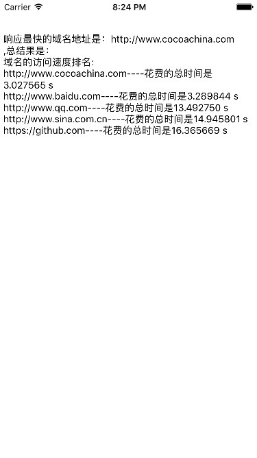
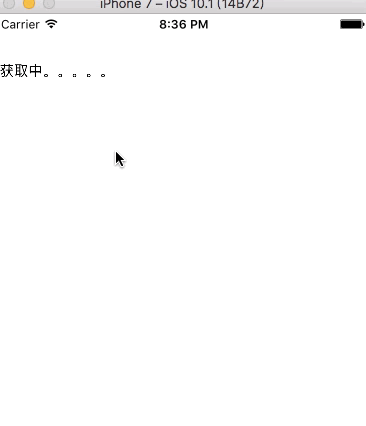

# DomainChese
一个简单的最佳域名选择工具
##这个工具使用NSURLSession 作为网络请求类。通过域名网址响应时间作为判断依据。可以自行设定需要响应的次数和响应的域名地址。
##接口
```
/**
*  测试域名网络状态
*
*  @param times       每个域名测试的次数
*  @param domains     域名数组（元素格式为：http://www.baidu.com）
*  @param domainblock 返回最优的域名Str
*/
+(void)domainSelectWithTimes:(int)times domains:(NSArray *)domains succseBlock:(void (^)(NSString *bestDomain,NSString *result))domainblock;

```


